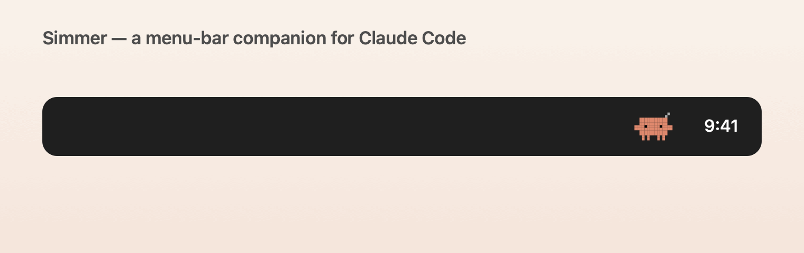
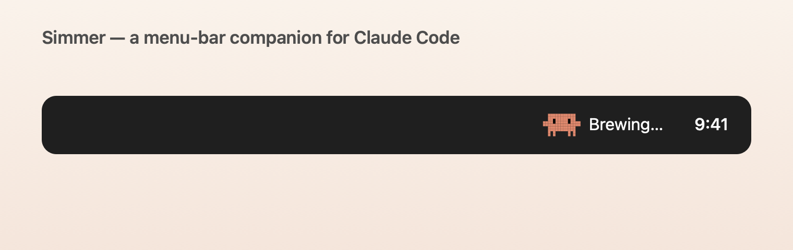
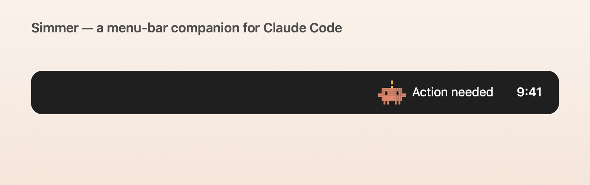
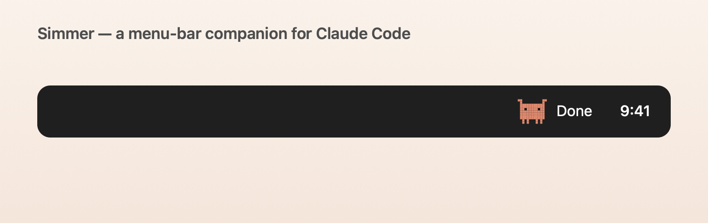

# Simmer

A tiny macOS menu bar companion for [Claude Code](https://claude.com/claude-code).
A little pixel crab sits in your menu bar and mirrors what Claude is doing — so
you can glance up (or walk away) and know when it needs you.



<p>
  
  
  
</p>

- 🦀 **Working** — the crab's legs wiggle, with a slowly-changing status word
- 🔔 **Needs you** — a "!" pops up, plus a soft chime + notification
- ✅ **Done** — arms-up celebration and a gentle "finished" chime
- 💤 **Idle** — he naps

It handles **multiple Claude sessions at once** (it shows the most urgent one and
lists each in the dropdown), and everything runs **entirely on your Mac** — no
server, no account, no telemetry, nothing leaves your machine.

> Not affiliated with or endorsed by Anthropic. "Claude" and "Claude Code" are
> trademarks of Anthropic. Simmer is an independent, free community tool.

## Install

Requires [Xcode](https://apps.apple.com/app/xcode/id497799835) (free).

**One command** — clone and build:

```sh
gh repo clone grantgws/Simmer && cd Simmer && ./install.sh
```

That builds Simmer and drops it in `/Applications`. (Or just open
`Simmer.xcodeproj` in Xcode and hit Run.)

Then:
1. Click the crab in your menu bar → **Connect to Claude Code** (adds Simmer's
   hooks to `~/.claude/settings.json` for you).
2. **Restart Claude Code** (hooks load when a session starts).
3. Optional: toggle **Launch at login**.

## Permissions

Simmer asks for the minimum, and only when needed:

- **Notifications** — to alert you when Claude needs input. (First run prompts you.)
- **Automation (Terminal)** — *only* when you click a session to jump to its
  terminal. It can bring a window to the front; it cannot type or change anything.

Nothing else — Simmer never sends data off your Mac.

## Uninstall (clean)

Click **Disconnect from Claude Code** in the dropdown *before* deleting the app.
This removes Simmer's hooks so your Claude Code keeps working. Then quit and drag
the app to the Trash.

## How it works

Claude Code fires [hooks](https://docs.claude.com/en/docs/claude-code/hooks) on
events (prompt submitted, tool use, waiting for you, turn finished). Simmer's
hook writes a tiny per-session status file under `~/.claude/simmer/sessions/`,
and the app watches those files and updates the crab. That's it.

## License

MIT — see [LICENSE](LICENSE).
